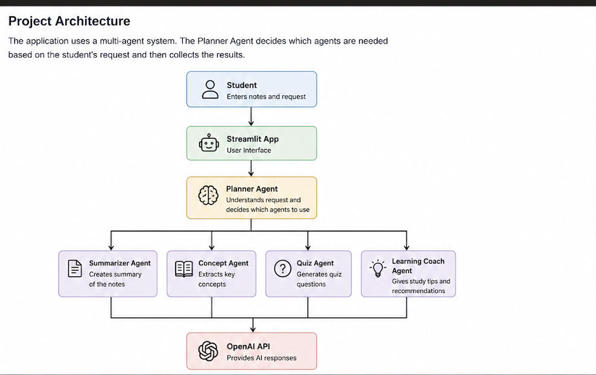
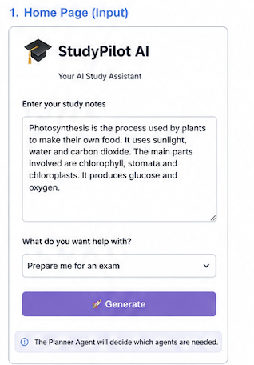
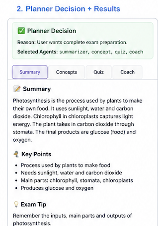
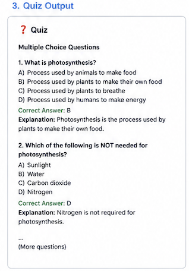

# Study Planner

## About

StudyPilot AI is a study helper that I built using Python, Streamlit, and the OpenAI API.

The goal of this project is to help students study more easily. The app can summarize notes, find important concepts, create quiz questions, and give study tips.

One interesting part of this project is the **Planner Agent**. Instead of always doing the same steps, it first understands what the student wants and then decides which AI agents should be used.

---

## Project Architecture



---

## Features

* Summarize class notes
* Find important concepts
* Generate quiz questions
* Give study tips
* Planner Agent chooses which AI agents to use

---

## Screenshots

### Home Page



### Planner Decision



### Quiz Output



---

## Technologies Used

* Python
* Streamlit
* OpenAI API
* Git & GitHub

---

## Project Structure

```text
StudyPilot-AI/
│
├── app.py
├── planner_agent.py
├── agents/
├── utils/
├── images/
├── requirements.txt
└── README.md
```

---

## How to Run

1. Clone the repository.
2. Create a virtual environment.
3. Install the required packages.

```bash
pip install -r requirements.txt
```

4. Add your OpenAI API key to a `.env` file.

```text
OPENAI_API_KEY=your_api_key
```

5. Run the application.

```bash
streamlit run app.py
```

6. Open your browser and go to:

```text
http://localhost:8501
```

---

## What I Learned

While building this project, I learned:

* Python
* Streamlit
* OpenAI API
* Prompt Engineering
* AI Agents
* Git and GitHub

I also learned how different AI agents can work together to solve a problem.

---

## Future Improvements

* Upload PDF notes
* Save study history
* Create flashcards
* Support more AI models

---

This project was built for learning and to improve my Python and AI development skills.
